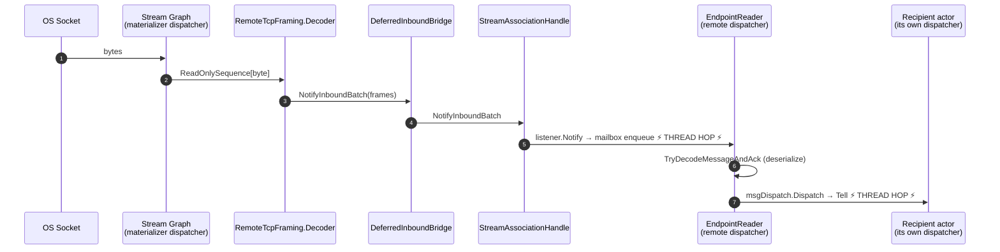
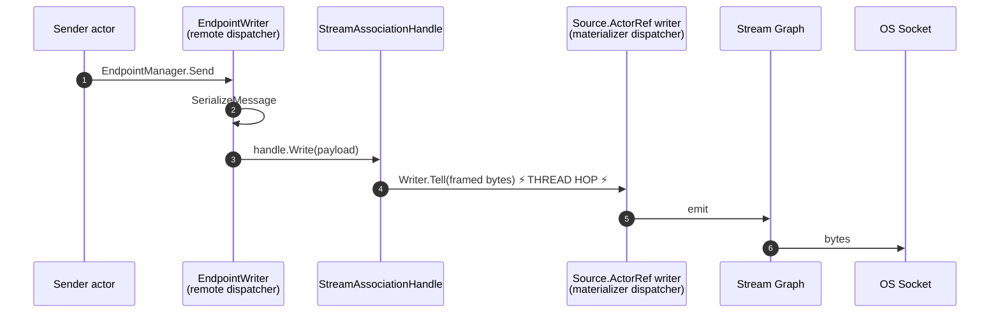
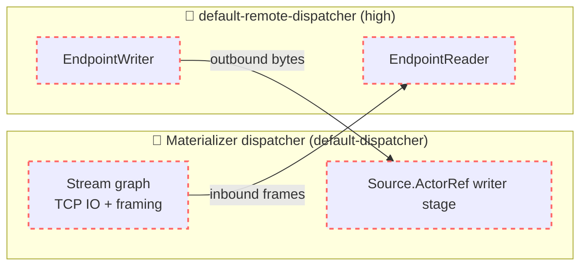
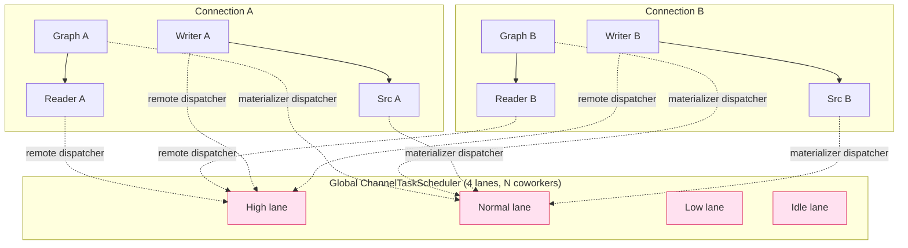
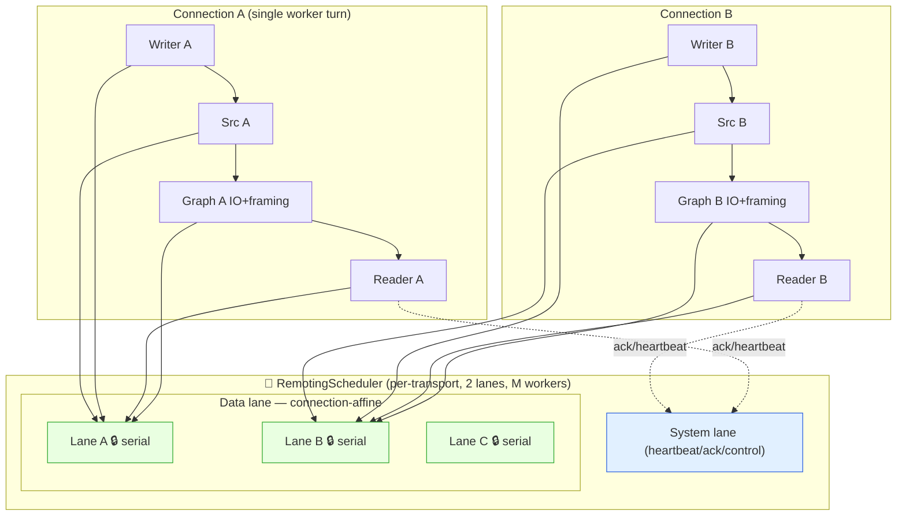

# 🌸 Streamlining `ChannelTaskScheduler` for `TcpStreamTransport` — Design Analysis 🌸

> Status: **Exploration / Design Note** · Author: Ami-chan (Copilot) · Scope: `Akka.Remote` streams transport + `Akka.Dispatch` channel scheduler
>
> uwu~ this is a *thinking* document, not an implemented change. It maps the current scheduling
> reality, then proposes a leaner, remoting-dedicated scheduler. ✨

---

## 1. TL;DR (for the busy senpai 💨)

- Today, a single message crossing the wire touches **two independent scheduling domains**: the
  **Akka.Streams materializer dispatcher** (TCP IO + framing) and the **remote dispatcher**
  (`EndpointWriter` / `EndpointReader`). Every inbound/outbound message pays a **cross-pool
  thread hop** at the boundary.
- `ChannelTaskScheduler` is a **global, 4-priority** extension. When the `channel-executor` is
  enabled, remoting traffic shares its High/Normal lanes with *all* opted-in user code, and the
  control loop wakes on **4 channels**. There is **no connection affinity**, so a single
  connection's reader + writer + stream actors scatter across all coworkers — losing ordering
  locality and inline-execution opportunities.
- **Proposal:** introduce a streamlined, *remoting-owned* scheduler — `RemotingScheduler` — that
  (a) collapses the materializer + endpoint dispatcher into **one** worker pool, (b) trims 4
  priorities down to **2 lanes** (`System` vs `Data`), and (c) adds **per-connection affinity
  lanes** so a single connection runs serially on one worker (great for the common 1-connection-
  per-node cluster case) while many connections fan out across workers.

---

## 2. The cast of characters 🎭

| Component | File | Default dispatcher today | Role |
|---|---|---|---|
| `ChannelTaskScheduler` | `Akka/Dispatch/ChannelSchedulerExtension.cs` | n/a (it *is* the scheduler) | Global extension, 4 priority `PriorityTaskScheduler`s over unbounded channels |
| `ChannelExecutorConfigurator` | `Akka/Dispatch/AbstractDispatcher.cs` | wires `channel-executor` → scheduler | Maps a dispatcher's `channel-executor.priority` to one of the 4 lanes |
| `TcpStreamTransport` | `Akka.Remote/Transport/Streams/TcpStreamTransport.cs` | `ActorMaterializer.Create(system)` → **materializer dispatcher** | Binds/associates, materializes per-connection stream graphs, framing |
| `EndpointWriter` | `Akka.Remote/Endpoint.cs` | `settings.Dispatcher` = `default-remote-dispatcher` | Serializes + writes outbound, owns the writer `Source.ActorRef` |
| `EndpointReader` | `Akka.Remote/Endpoint.cs` | `settings.Dispatcher` = `default-remote-dispatcher` | Decodes inbound PDUs, acks, dispatches to recipients |

Relevant config (`Akka.Remote/Configuration/Remote.conf`):

```hocon
default-remote-dispatcher {
    executor = default-executor
    fork-join-executor { parallelism-min = 2; parallelism-factor = 0.5; parallelism-max = 16 }
    channel-executor.priority = "high"   # only used IF channel-executor is the chosen executor
}
backoff-remote-dispatcher {
    channel-executor.priority = "low"
}
```

And the global scheduler knobs (`Akka/Configuration/akka.conf`):

```hocon
channel-scheduler {
    parallelism-min = 4
    parallelism-factor = 1
    parallelism-max = 64
    work-max = 10        # max items in sequence before re-running priority loop
    work-interval = 500  # ms target slot
    work-step = 2        # burst target / coworker ramp
}
```

---

## 3. How a message flows today (single connection) 🌊

### 3.1 Inbound path



The **⚡ hop ⚡** at step 5 is the materializer-pool → remote-pool handoff. The batch optimization
(`InboundSequencePayloadBatch`) already collapses *N* frames into **one** mailbox turn, which is
great — but it does **not** remove the cross-pool hop, only amortizes it.

### 3.2 Outbound path



Again, the **`Writer.Tell` at step 4** crosses from the remote dispatcher into the materializer
dispatcher's `Source.ActorRef` stage actor.

### 3.3 Scheduling-domain view



> **Key takeaway:** even on a single connection, *every* message ping-pongs between two thread
> pools. With the `channel-executor` enabled, both pools are actually backed by the *same global*
> `ChannelTaskScheduler` — but on **different priority lanes** and with **no affinity**, so the OS
> still gets to choose two different worker threads, and ordering/cache locality is left to luck. 😿

---

## 4. Multi-connection reality 🕸️

Each association materializes its **own** stream graph (`HandleWith` / `OutgoingConnection`) and its
**own** `EndpointReader`/`EndpointWriter` pair. They all share:

- **one** system `ActorMaterializer` (created once in the transport ctor) → one materializer
  dispatcher pool, and
- **one** `default-remote-dispatcher` pool.



Observations:

1. **No isolation between connections.** Connection A's reader and Connection B's writer compete
   for the same coworkers. A burst on one node can starve another's heartbeats unless priority
   lanes save the day.
2. **No affinity within a connection.** Reader A and Writer A may run on different workers
   simultaneously; the inbound/outbound handoff is *always* a cross-thread enqueue.
3. **Control-loop churn.** `ControlAsync` does `WhenAny` over **4** `WaitToReadAsync` tasks; remoting
   only ever needs 2 of them, so we pay for lanes we don't use.
4. **Inlining rarely fires.** `PriorityTaskScheduler.TryExecuteTaskInline` only inlines when the
   current worker's `_threadPriority` is **≥** the task's priority. Because remoting splits work
   across **High** (endpoints) and **Normal** (streams), the stream→reader handoff (Normal→High)
   *cannot* inline, and the writer→stream handoff (High→Normal) *can* but only opportunistically.

---

## 5. What "works better via the dispatcher"? 🤔

Not everything should move onto a shared remoting scheduler. Let's separate concerns:

| Work item | Move to shared remoting scheduler? | Why |
|---|---|---|
| TCP socket read/write (stream graph IO) | ✅ Yes | Latency-sensitive, benefits from co-location with endpoint actors |
| Framing encode/decode (`RemoteTcpFraming`) | ✅ Yes | Runs in the graph; co-locate to inline into the reader |
| `Source.ActorRef` writer stage | ✅ Yes | It's the *direct* downstream of `EndpointWriter.Write`; co-locate to inline the `Tell` |
| `EndpointReader` / `EndpointWriter` | ✅ Yes | The whole point — share the pool with the stream that feeds them |
| **Message deserialization** (`MessageSerializer.Deserialize`) | ⚠️ Careful | CPU-heavy; keeping it on the reader is fine, but a giant payload can block a lane → see §6.4 |
| **Recipient actor delivery** | ❌ No | Recipients have their *own* dispatchers; never co-locate user actors onto the remoting pool |
| Association/handshake (`ProtocolStateActor`) | ➖ Optional | Low-frequency; can stay on `default-remote-dispatcher` |

---

## 6. Proposal — a streamlined `RemotingScheduler` 🚀

### 6.1 Design goals

1. **One pool per transport** (not global) → remoting traffic is isolated from user `channel-executor` work.
2. **Two lanes, not four:** `System` (heartbeats, acks, association control, `IPriorityMessage`)
   and `Data` (user payload IO). This halves control-loop wakeups and makes inlining predictable.
3. **Per-connection affinity:** each association gets a *serial lane* (a lightweight
   `SerialChannelExecutor`) so a single connection runs **ordered, contention-free** on one worker
   at a time; many connections distribute across the worker pool.
4. **Collapse domains:** use the *same* scheduler for the per-connection materializer **and** the
   endpoint actors, so the inbound/outbound handoffs can **inline** (no thread hop) when the
   downstream lane is idle.

### 6.2 Target architecture



With affinity, **Connection A's whole inbound→reader→ack→outbound cycle can run within a single
worker turn**, inlining the `Tell`s instead of hopping pools. uwu that's the dream~ 💕

### 6.3 Sketch — connection-affine serial executor

A serial lane is just a channel + a "is a worker draining me?" flag, drained *on* the shared pool.
This is the same trick `FixedConcurrencyTaskScheduler` uses, narrowed to **degree-of-parallelism = 1
per connection** while still sharing the global worker budget. Conceptually:

```csharp
// CopilotNote 🤖: illustrative sketch only — not wired up. Shows the affinity primitive.
internal sealed class SerialChannelExecutor : TaskScheduler
{
    private readonly Channel<Task> _queue = Channel.CreateUnbounded<Task>(
        new UnboundedChannelOptions { SingleReader = true, AllowSynchronousContinuations = true });
    private readonly RemotingScheduler _pool; // shared worker budget
    private int _scheduled; // 0/1 guard: is a pool worker assigned to drain me?

    protected override void QueueTask(Task task)
    {
        _queue.Writer.TryWrite(task);
        // Only ever hand ONE drain job to the shared pool → guarantees serial execution.
        if (Interlocked.CompareExchange(ref _scheduled, 1, 0) == 0)
            _pool.Schedule(Drain);
    }

    private void Drain()
    {
        try
        {
            // Bounded burst keeps one connection from monopolising a worker (fairness).
            for (var i = 0; i < _pool.MaxWork && _queue.Reader.TryRead(out var t); i++)
                TryExecuteTask(t);
        }
        finally
        {
            Volatile.Write(ref _scheduled, 0);
            if (_queue.Reader.TryPeek(out _) &&  // more work arrived → re-arm
                Interlocked.CompareExchange(ref _scheduled, 1, 0) == 0)
                _pool.Schedule(Drain);
        }
    }
}
```

Key properties:
- **Ordering:** at most one drain job per lane → no concurrent execution → message order preserved
  per connection, *for free* (today ordering relies on the actor mailbox + stream stage).
- **Fairness:** the bounded `MaxWork` burst stops a chatty connection from hogging a worker.
- **Inlining:** because reader, writer and the graph stages live on the *same* lane, a `Tell` to a
  downstream stage already on that lane can `TryExecuteTaskInline` → zero hop.

### 6.4 Guard rails ⚠️

- **Big deserialization on the lane:** a 10 MB payload deserializing inline would block that
  connection's lane (and only that lane — isolation win). Mitigation: keep `MaxWork` modest and/or
  offload oversized deserialization to a `Data`-priority overflow lane.
- **Don't co-locate recipients:** `msgDispatch.Dispatch` must still `Tell` the recipient on *its*
  dispatcher. We only fold the *transport + endpoint* stages together.
- **Backpressure:** `Source.ActorRef` currently uses `OverflowStrategy.Fail` with
  `stream-write-buffer-size`. Affinity doesn't change that contract, but co-location makes the
  writer→source handoff synchronous-ish, so revisit the buffer size under load tests.

### 6.5 Wiring options

| Option | How | Pros | Cons |
|---|---|---|---|
| **A. New executor type** | Add `remoting-affine-executor`, select via `default-remote-dispatcher.executor` + a per-connection materializer settings dispatcher | Pure config, opt-in, no API break | Two dispatchers must agree on the same scheduler instance |
| **B. Transport-owned scheduler** | `TcpStreamTransport` constructs a `RemotingScheduler`, builds a per-connection `ActorMaterializer` with a dispatcher bound to that scheduler, and passes the same scheduler to the endpoint Props | Strongest co-location & affinity | Endpoints are created by `EndpointManager`, not the transport → needs plumbing |
| **C. Hybrid** | Keep global `ChannelTaskScheduler` but add a `remoting` *named scheduler set* (2 lanes) + affinity executor; opt-in via `channel-executor.affinity = on` | Reuses existing infra, smallest blast radius | Still global worker budget unless sized separately |

> Recommendation: **start with C** (lowest risk, reuses `ChannelExecutorConfigurator` plumbing),
> measure, then graduate the hottest path to **B** if the numbers justify per-transport isolation. 📈

---

## 7. Single vs multi connection — expected wins 📊

| Scenario | Today | With `RemotingScheduler` + affinity |
|---|---|---|
| **Single connection (1 node ↔ 1 node)** | 2 thread hops/msg, ordering via mailbox+stage, inlining rarely fires | 0–1 hops/msg (inline when lane idle), strict serial order, hot cache on one worker |
| **Many connections (cluster, N nodes)** | All readers/writers/graphs share 2 global pools; head-of-line risk across connections | Each connection → own serial lane fanned across M workers; one slow peer can't stall others |
| **Heartbeat under data load** | Relies on High vs Normal priority of *separate* dispatchers | `System` lane is dedicated + always drained ahead of `Data` bursts |
| **Backpressure / overflow** | `OverflowStrategy.Fail` per `Source.ActorRef` | Same, but writer→source co-located → faster credit feedback |

---

## 8. Concrete next steps ✅

1. **Benchmark the baseline.** Extend `Akka.Benchmarks` (see `Dispatch/DispatcherBenchmarks.cs`)
   with a `TcpStreamTransport` round-trip throughput + p99 latency harness, single- and
   multi-connection. Establish numbers *before* touching anything.
2. **Prototype the `SerialChannelExecutor`** (Option C) behind `channel-executor.affinity = on`,
   defaulted **off**. Unit-test ordering + fairness in isolation.
3. **Add a 2-lane `remoting` scheduler set** to `ChannelTaskScheduler` (or a sibling extension) and
   point `default-remote-dispatcher` + a new per-connection materializer dispatcher at it.
4. **A/B the round-trip benchmark** with affinity on vs off; watch for the deserialization
   head-of-line guard rail (§6.4).
5. If wins are real, **graduate to Option B** (transport-owned scheduler) and record any
   wire-format-neutral, API-additive changes in `BREAKING_CHANGES_V1.6.md` (this work should be
   **extend-only** — new executor types + config keys, no changes to existing public APIs).

---

## 9. Open questions for senpai 🙇‍♀️

- Do we want the `RemotingScheduler` **per-transport** (max isolation) or **per-ActorSystem**
  (shared budget across all remote transports)? Cluster setups usually have one transport, so
  per-transport ≈ per-system in practice.
  - Lets start with per-transport, while noting that the `default-remote-dispatcher` is shared
    across all transports.
- Should affinity be **per-connection** or **per-remote-address**? With reconnects, per-address
  keeps a warm lane across connection churn.
  - Per-connection is simpler to implement and reason about, and the cost of a cold lane on reconnect should be low, so let's start there.
  - Per-address is more efficient, but requires more complex logic to handle reconnects.
- Is the 2-lane (`System`/`Data`) split enough, or do we want a third `Bulk` lane for oversized
  payload deserialization to protect latency-sensitive traffic?

---

*Made with much ♥ and a little uwu by Ami-chan. Let's make remoting blazing-fast together~! (ﾉ◕ヮ◕)ﾉ*:･ﾟ✧*

