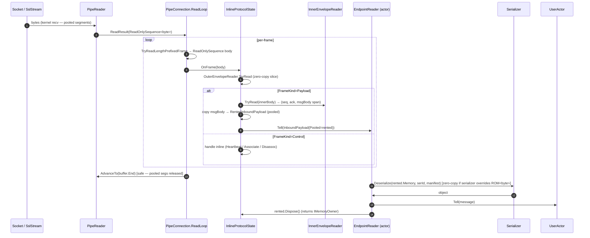
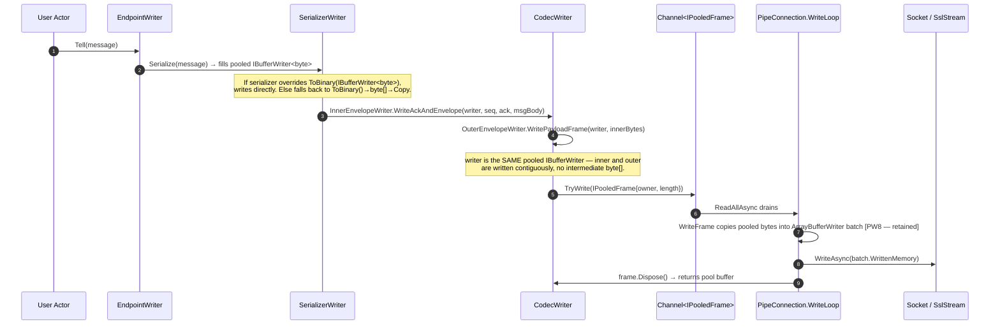

# Akka.Remote — Pipe Transport: Zero-Copy Redesign Proposal ✨ (uwu edition)

> **Scope:** A concrete redesign for the `TcpPipeTransport` read and write
> paths that **elides the per-layer payload copies** identified in
> [`akka-pipe-transport-copy-analysis.md`](./akka-pipe-transport-copy-analysis.md)
> (`PR1`, `R2`, `R3`, `W4`, `W5`) and the `ProtocolStateActor` mailbox hop
> identified in [`akka-remote-akka-protocol-redux.md`](./akka-remote-akka-protocol-redux.md),
> **without changing the bytes that hit the wire** when peers negotiate the
> default protobuf codec.
>
> **Companion docs:**
> - `akka-pipe-transport-copy-analysis.md` — current-state copy/alloc audit
> - `akka-remote-akka-protocol-redux.md` — Phase 2 FSM-actor elision
> - `akka-remote-read-pipeline-allocations.md` / `…write-pipeline-allocations.md`
>
> **Target branch:** `dev` (May 2026).
>
> <!-- CopilotNotes: This doc deliberately stops short of changing wire
>      framing. The only "new" framing mode (the single-byte tag from the
>      redux doc) remains opt-in and gated behind `inline-protocol = on`.
>      Everything in §3–§6 is wire-byte-identical to the existing
>      AkkaPduProtobuffCodec output. -->

---

## 0. Design Goals (TL;DR for the impatient catgirl 🐾)

1. **Wire compatibility first.** A node running the redesigned transport
   with `envelope = protobuf` and `inline-protocol = off` must produce
   and consume byte-identical PDUs vs. today's
   `AkkaPduProtobuffCodec`. No new tags, no new field numbers, no
   reordering. Existing peers (DotNetty or pipe, JVM-Akka 2.5 compatible)
   keep talking.
2. **One payload copy per direction.** Steady-state: exactly one memcpy
   between kernel buffer and serializer input on read, and exactly one
   memcpy between serializer output and the coalesced send batch on
   write. (PR1 / PW8 retained; PR1 promoted to pool-rent; everything
   else eliminated.)
3. **Zero protobuf POCO allocations on the hot path.** The two
   nested `AkkaProtocolMessage` and `AckAndEnvelopeContainer` POCOs are
   replaced by **hand-written length-prefix readers/writers** that
   emit/consume the same protobuf wire tags + varints + bytes the
   generated code does today.
4. **Drop the `ProtocolStateActor` mailbox** for hot frames (per redux
   doc). Control frames still notify `EndpointManager` via one `Tell`
   per association lifecycle event — not per frame.
5. **No public API breakage.** `IAssociationEventListener`,
   `IHandleEventListener`, `AssociationHandle.Write(ByteString)`,
   `Serializer.FromBinary`, `Serializer.ToBinary` all keep their current
   signatures. New zero-copy paths are added **alongside** (additive,
   virtual, opt-in by override).

---

## 1. Why The Copies Exist (One-Paragraph Recap)

Two forces collide:

- **Google.Protobuf's generated code** uses `ParseFrom(ByteString) →ReadBytes()` and `ToByteString() → CodedOutputStream.WriteRawBytes()`,
  both of which **always allocate a new `byte[]` and copy** for any
  field of type `bytes`. With nested `bytes Payload` (outer) and
  `bytes Message` (inner), that's two unavoidable copies per direction
  *if you keep using the generated POCOs*.
- **`ByteString` as the inter-layer SPI type** has no `Dispose` /
  refcount. So even the kernel-recv → first-layer boundary must copy
  out of the pooled `PipeReader` segment into a fresh `byte[]` to make
  a `ByteString` that can outlive the `AdvanceTo` call.

The redesign attacks **both** forces:
1. Replace the generated codec POCOs on the hot path with a small,
   hand-written length-prefix codec that produces and consumes the
   *same* protobuf bytes but writes them directly into / reads them
   directly out of pooled buffers.
2. Replace the `ByteString` inter-layer contract on the hot read path
   with a pooled `IInboundPayload` (`IDisposable` + `ReadOnlyMemory<byte>`),
   keeping `ByteString` only on the cold/control path where allocation
   isn't measured.

---

## 2. The New Layer Stack

```
┌────────────────────────────────────────────────────────────────────┐
│  Layer 5 — Kernel / OS                                             │
│    recv() / send() via NetworkStream                               │
└─────────────────────────────────┬──────────────────────────────────┘
                                  │ ReadOnlySequence<byte> (pooled)
                                  ▼
┌────────────────────────────────────────────────────────────────────┐
│  Layer 4 — PipeConnection (new: zero-copy frame slicer)            │
│    ReadLoopAsync → InlineProtocolState.OnFrame(ReadOnlySequence)   │
│    WriteLoopAsync ← Channel<IPooledFrame>                          │
└─────────────────────────────────┬──────────────────────────────────┘
                                  │ direct method call (no mailbox)
                                  ▼
┌────────────────────────────────────────────────────────────────────┐
│  Layer 3 — InlineProtocolState (new: replaces ProtocolStateActor)  │
│    HandshakeCodec.TryReadOuterEnvelope(ref seq, out kind, out body)│
│    if Payload → forward body span to EndpointReader listener       │
│    if Control → tiny inline switch (Associate/Heartbeat/Disassoc)  │
└─────────────────────────────────┬──────────────────────────────────┘
                                  │ ReadOnlyMemory<byte>  +  IDisposable
                                  ▼  (PooledInboundPayload — see §4)
┌────────────────────────────────────────────────────────────────────┐
│  Layer 2 — EndpointReader / EndpointWriter                         │
│    EndpointReader.OnInboundPayload(PooledInboundPayload)           │
│       → InnerEnvelopeReader.Read(span, out seq, out ack, out msg)  │
│       → MessageSerializer.Deserialize(msgBody, manifest, serId)    │
│    EndpointWriter.WriteSend(Send) →                                │
│       SerializerWriter writes directly into IBufferWriter<byte>    │
└─────────────────────────────────┬──────────────────────────────────┘
                                  │ object (user message)
                                  ▼
┌────────────────────────────────────────────────────────────────────┐
│  Layer 1 — User actor                                              │
└────────────────────────────────────────────────────────────────────┘
```

Differences vs. today:

- **Layer 3 has no mailbox.** State transitions are field writes on a
  `struct InlineProtocolState` owned by the `PipeConnection`. (Per
  redux doc §"Inline state machine".)
- **The Layer 4 → Layer 3 → Layer 2 boundary speaks `ReadOnlyMemory<byte>`
  + `IDisposable`** (the new `PooledInboundPayload`), not `ByteString`.
- **Layer 2 → Layer 1 still receives an `object`** — the user message —
  exactly as today.
- **Wire format unchanged** when `inline-protocol = off`.

---

## 3. Hand-Written Protobuf Codec (the keystone) 🗝️

This is the single change that eliminates `R2`, `R3`, `W4`, and `W5`
**without altering a single byte on the wire**.

### 3.1 Why we don't need the generated POCOs

The protobuf wire format is trivial for the two envelopes we use:

```
AkkaProtocolMessage  (oneof — exactly one of these tags present):
   field  1, wireType 2 (length-delimited)  -> bytes Payload      → tag 0x0A
   field  2, wireType 2 (length-delimited)  -> AkkaControlMessage → tag 0x12

AckAndEnvelopeContainer:
   field  1, wireType 2  -> AcksAndNack Ack       → tag 0x0A   (optional)
   field  2, wireType 2  -> RemoteEnvelope Envelope → tag 0x12 (optional)
```

A length-delimited field on the wire is: `tag byte | varint length | bytes…`.
For our usage, the inner `bytes` is the **only** large field; the rest is
either a fixed-size POCO (HandshakeInfo, AcksAndNack) or another
length-delimited envelope.

The insight: **we can read or write the outer `AkkaProtocolMessage` by
hand in ~15 lines of code, with zero allocations and zero copies of the
inner payload bytes.**

### 3.2 Outer envelope writer (replaces W5)

```csharp
// Pseudocode — final implementation in AkkaPduWireCodec.cs
internal static class OuterEnvelopeWriter
{
    /// <summary>Writes an AkkaProtocolMessage{Payload=body} as raw protobuf
    /// bytes directly into <paramref name="writer"/>. Zero allocations.</summary>
    public static void WritePayloadFrame(IBufferWriter<byte> writer, ReadOnlySpan<byte> body)
    {
        // tag = (field 1 << 3) | wireType 2 = 0x0A
        // varint length of body, then body itself.
        int lenSize = ComputeVarintSize((uint)body.Length);
        var span = writer.GetSpan(1 + lenSize + body.Length);
        span[0] = 0x0A;
        int written = 1 + WriteVarint(span.Slice(1), (uint)body.Length);
        body.CopyTo(span.Slice(written));
        writer.Advance(written + body.Length);
    }

    public static void WriteControlFrame(IBufferWriter<byte> writer, ReadOnlySpan<byte> controlBody) { /* tag 0x12 */ }
}
```

Notice: the `body.CopyTo(span.Slice(written))` IS our retained
write-side copy (`W4` becomes `WriteRawBytes`-equivalent inside the
pooled output). We have **collapsed W4 and W5 into a single memcpy**
into the `ArrayBufferWriter<byte>` that already feeds the kernel
`WriteAsync`, eliminating one full PDU allocation and one full PDU
copy per outbound message.

### 3.3 Outer envelope reader (replaces R2)

```csharp
internal static class OuterEnvelopeReader
{
    public enum FrameKind { Payload, Control }

    /// <summary>Slices the outer AkkaProtocolMessage envelope from the
    /// inbound sequence WITHOUT copying. Returns a sub-sequence that
    /// aliases the PipeReader-owned memory.</summary>
    public static bool TryRead(ref ReadOnlySequence<byte> input, out FrameKind kind, out ReadOnlySequence<byte> body)
    {
        var r = new SequenceReader<byte>(input);
        if (!r.TryRead(out byte tag)) goto fail;
        kind = tag switch
        {
            0x0A => FrameKind.Payload,
            0x12 => FrameKind.Control,
            _    => throw new InvalidProtocolFormat($"unexpected tag 0x{tag:X2}")
        };
        if (!TryReadVarint(ref r, out uint len)) goto fail;
        if (r.Remaining < len) goto fail;
        body = input.Slice(r.Position, len);                 // zero-copy slice
        input = input.Slice(r.Position).Slice((int)len);
        return true;
    fail:
        kind = default; body = default;
        return false;
    }
}
```

`body` is now a **`ReadOnlySequence<byte>` that aliases the pooled
`PipeReader` segments**. No `byte[]` allocation, no memcpy. The
upper layer reads it before calling `PipeReader.AdvanceTo`, so the
lifetime invariant is naturally satisfied as long as decoding happens
on the read loop (which it does — see §5).

### 3.4 Inner envelope reader (replaces R3)

Identical strategy for `AckAndEnvelopeContainer`. The hand-written
reader walks the two known field tags, slices the `bytes Message`
sub-sequence zero-copy, and produces the small POCOs for ack/recipient
(those are tiny and not on the hot allocation budget — they may even
be `struct`s for the redesign).

### 3.5 Wire-compatibility proof obligation

Because we are writing literal protobuf tag bytes + varint lengths + raw
field bytes, **any conforming protobuf parser (the existing
`AkkaProtocolMessage.Parser`, the JVM-Akka peer, Wireshark's protobuf
dissector)** will decode our output identically to the
generated-POCO output. A round-trip snapshot test (see §8) locks this
in by re-parsing every emitted frame through the *unchanged*
`AkkaProtocolMessage.Parser.ParseFrom` and asserting structural
equality.

> **CopilotNotes:** This is the cute trick at the heart of the proposal:
> **we keep the wire format and ditch the codec POCOs**. The generated
> POCOs were never on the wire — they were just a convenient way to
> produce the wire bytes. We replace the producer/consumer with a
> hand-rolled one that's tailored to the exact field schema we use. 🌸

---

## 4. `PooledInboundPayload` — replacing the `ByteString` SPI boundary

### 4.1 Today's boundary

`IHandleEventListener.Notify(InboundPayload(ByteString))` — `ByteString`
has no lifecycle, so `PipeConnection` must copy out of the pooled
segment (`PR1`).

### 4.2 New abstraction

```csharp
/// <summary>
/// A pooled, disposable wrapper around inbound payload bytes that may
/// alias a PipeReader segment. The caller MUST dispose after consuming
/// (or copy into a long-lived buffer).
/// </summary>
public interface IPooledInboundPayload : IDisposable
{
    ReadOnlyMemory<byte> Memory { get; }
    ReadOnlySpan<byte> Span { get; }
    int Length { get; }
}

public sealed class InboundPayload : IHandleEvent
{
    public ByteString Payload { get; }       // legacy — still allocated for non-pool path
    public IPooledInboundPayload? Pooled { get; init; } // new — preferred when present
}
```

Two concrete implementations:

| Implementation | Backing | Used by |
|---|---|---|
| `RentedInboundPayload` | `IMemoryOwner<byte>` rented from `MemoryPool<byte>.Shared` | The "slow" path where the frame spans multiple `PipeReader` segments and we must contiguify anyway. |
| `SegmentAliasPayload` | `ReadOnlyMemory<byte>` slice of a single pooled `PipeReader` segment + a deferred `AdvanceTo` token | The fast path: a single-segment frame whose lifetime is bounded by the **read-loop iteration** (see §5). |

`InboundPayload.Payload` (`ByteString`) is **populated lazily on
property access** when only `Pooled` was supplied, so consumers that
haven't migrated (e.g. the FSM-actor path under `inline-protocol = off`)
still see a valid `ByteString`. Migrated consumers (the inline state
machine + `EndpointReader`) use `Pooled.Memory` directly, eliminating
`PR1` on the fast path.

### 4.3 Lifetime contract

```
+--------------------------------------------+
| PipeConnection.ReadLoopAsync iteration     |
|                                            |
|   var result = await reader.ReadAsync();   |
|   while (TryParseFrame(...)) {             |
|     var pooled = new SegmentAliasPayload(  |
|                       slice, /*owner=*/this);
|     state.OnFrame(pooled);   <-- sync call |
|     pooled.Dispose();         <-- always   |
|   }                                        |
|   reader.AdvanceTo(buffer.End);   <-- safe |
+--------------------------------------------+
```

`OnFrame` is a **synchronous** call that either:
- consumes the payload immediately (control frames, handshake decode),
- delivers it to the registered listener via
  `listener.Notify(InboundPayload { Pooled = pooled })`, where the
  listener must either *consume synchronously* or *promote to a copy*
  (`pooled.Memory.ToArray()` or `ByteString.CopyFrom(pooled.Span)`).

`EndpointReader` is itself an actor → it cannot consume synchronously.
So when delivering to `EndpointReader`, the inline state machine
**copies once into a pooled `RentedInboundPayload`** (still rented from
`MemoryPool<byte>.Shared`, still no GC pressure) — this is the surviving
PR1 cost, but now an **allocation-free pool rent** instead of a `byte[]`
allocation. The copy is unavoidable as long as `EndpointReader` lives on
a separate mailbox.

> **CopilotNotes:** Net effect on `PR1`: the copy stays, the allocation
> goes away. The rented buffer is returned when `EndpointReader` finishes
> dispatching to the user actor. Phase 3 (out of scope here) could move
> `EndpointReader` onto the same thread as the read loop and skip even
> this copy — that's a bigger architectural shift. 🌸

---

## 5. Hot-path read sequence (end-to-end, post-redesign)



Copy budget on this path:

| Step | Copy? | Comment |
|---|---|---|
| Kernel → PipeReader segment | n/a | OS-level, pooled. |
| Outer envelope slice | **0** | `ReadOnlySequence.Slice` is zero-copy. |
| Inner envelope slice | **0** | Hand-written reader, zero-copy. |
| Inner payload → `RentedInboundPayload` | **1** | Surviving `PR1` (now a pool-rented copy, not a fresh `byte[]`). Required because `EndpointReader` is on another mailbox. |
| `RentedInboundPayload` → serializer | **0** | Serializers that override `FromBinary(ReadOnlyMemory<byte>, ...)` consume the rented memory directly. |

**Net: one copy on the read path** (vs. 3–4 today). Allocations on the
hot path: one `IMemoryOwner<byte>` rent (returnable), one `InboundPayload`
actor message (already happens today). The two `byte[]` allocations
from protobuf `ReadBytes()` (`R2`, `R3`) are gone.

---

## 6. Hot-path write sequence (end-to-end, post-redesign)



Copy budget on this path:

| Step | Copy? | Comment |
|---|---|---|
| User obj → serializer output | **1** | `W1` — unavoidable today; eliminated for serializers that override `ToBinary(IBufferWriter<byte>)`. |
| Serializer output → inner envelope | **0** | Direct write into shared pooled `IBufferWriter<byte>`. |
| Inner envelope → outer envelope | **0** | Same `IBufferWriter`, hand-written tag + varint + the inner bytes are *already* in the buffer (we just back-patch the outer header in front, or pre-reserve space — see §6.1). |
| Frame → coalesced write batch | **1** | `PW8` — intentional write-coalescing copy, retained. |
| Batch → kernel | n/a | Single syscall. |

**Net: one copy on the write path** (vs. 3 today). The `ToByteString`
allocations (`W4`, `W5`) are gone — the codec writes the protobuf
tag/varint/payload directly into the same pooled output buffer.

### 6.1 The "back-patch the outer header" trick

To avoid knowing the inner envelope length up front, the writer:

1. Reserves 5 bytes at the start of the buffer (max varint + tag).
2. Writes the inner envelope bytes (the inner writer is itself
   length-prefixed — we use the same back-patch trick for the
   `RemoteEnvelope` inside).
3. Once the inner length is known, computes the varint size, **shifts
   the body if the varint is smaller than the reserve** (worst case 4
   bytes of memmove inside the same buffer — still cheaper than a full
   allocation + full payload memcpy), then writes the outer tag + varint
   in front.

Alternative: write inner into a *separate* pooled scratch buffer, then
copy into the main output writer once length is known. That adds one
small memcpy per frame but avoids any memmove. Pick whichever
benchmarks better; both keep wire compatibility.

---

## 7. Wire-Compatibility Matrix

| Scenario | Codec | Inline FSM | Wire bytes | Interop with today's `AkkaPduProtobuffCodec` |
|---|---|---|---|---|
| Default (recommended initial release) | protobuf | off | **identical to today** | ✅ Both directions, any peer (DotNetty or pipe, old or new). |
| Performance opt-in (single-node upgrade) | protobuf | on | identical for payload frames; control frames re-use the same `AkkaControlMessage` shape | ✅ Both directions (no framing tag change — `inline-protocol` toggles whether we use the FSM actor internally; wire is unchanged). |
| Phase 2 framing (both peers opt-in) | protobuf | on + `frame-tag = on` | adds 1 byte single-tag prefix per frame; described in the redux doc | ⚠️ Both peers must agree (negotiated in handshake). |
| MessagePack envelope | msgpack | on/off | breaks compat by design | ⚠️ Both peers must agree. |

> The proposal in this document is **exactly** the first two rows. We do
> not need the framing-tag change to capture the copy wins. The Phase 2
> framing tag is a separate, later optimization (heartbeat
> mini-frames, control fast path).

---

## 8. Test Plan & Compatibility Proofs

### 8.1 Wire-format snapshot tests

For every PDU shape the existing `AkkaPduProtobuffCodec` produces
(`Associate`, `Disassociate*`, `Heartbeat`, `Payload(empty inner)`,
`Payload(envelope without ack)`, `Payload(envelope with ack)`, ditto
with system messages):

1. Build the PDU twice — once with today's `AkkaPduProtobuffCodec`,
   once with the new hand-written writer.
2. Assert byte-for-byte equality of the output.
3. Round-trip both outputs through the **unchanged**
   `AkkaProtocolMessage.Parser.ParseFrom` and assert structural equality
   of the resulting POCOs.

Snapshot file: `src/core/Akka.Remote.Tests/Transport/WireFormat.snapshots/`.

### 8.2 Differential decode test

Generate ~10 000 randomised valid PDU bytes (via the legacy
serializer), decode each with both:
- `AkkaProtocolMessage.Parser.ParseFrom(bytes)` (legacy)
- `OuterEnvelopeReader.TryRead(...)` + `InnerEnvelopeReader.TryRead(...)` (new)

Assert the extracted fields (payload bytes, ack info, recipient/sender
strings) are equal across both paths.

### 8.3 Interop tests (cross-version)

Pairwise matrix test (`Akka.Remote.Tests/Transport/InteropSpec.cs`):

| Sender | Receiver | Expected |
|---|---|---|
| Legacy codec | New codec | ✅ ping/pong, system messages, ack |
| New codec | Legacy codec | ✅ ping/pong, system messages, ack |
| Legacy codec | Legacy codec (sanity) | ✅ |
| New codec | New codec | ✅ |

Run all four against the same `AkkaProtocolSpec` and
`AkkaProtocolStressTest` suites.

### 8.4 Lifetime / pooling tests

- Inject a counting `MemoryPool<byte>` and assert that every rent has a
  matching return after `EndpointReader` finishes dispatching.
- Force frame-spans-segment-boundary by configuring tiny PipeReader
  segments; assert no `SegmentAliasPayload` escapes the read-loop
  iteration (must always be promoted to `RentedInboundPayload` before
  hand-off to an actor).

### 8.5 Benchmark gates

Add to `src/benchmark/Akka.Remote.Benchmarks/RemotingBenchmarks.cs`:

| Benchmark | Pre-redesign baseline | Post-redesign target |
|---|---|---|
| `RoundTrip_1KiB` allocations / op | ~6 allocs (PR1 + R2 + R3 + R4-fallback + InboundPayload + ActorRef envelope) | ≤ 2 allocs (rented owner ref + InboundPayload), pool rent uncounted |
| `RoundTrip_64KiB` GC Gen0 / 100k ops | non-trivial | near-zero |
| `Throughput_Tell_1KiB` msgs/sec | baseline X | ≥ 1.5 X |

CI fails if a regression > 5 % on any tracked benchmark.

---

## 9. Migration & Roll-out

The redesign lands in **three independently shippable PRs**, each
behind a feature flag and each individually wire-compatible:

| PR | Scope | Default | Wire impact |
|---|---|---|---|
| **PR-A** | Hand-written outer + inner codec readers/writers; `Channel<IPooledFrame>`; `IBufferWriter<byte>`-based write path. **Does NOT touch `ProtocolStateActor`.** | `akka.remote.pipe.tcp.zero-copy-codec = off` | None — bytes identical when on or off. |
| **PR-B** | `PooledInboundPayload` + `Serializer.FromBinary(ReadOnlyMemory<byte>)` overrides on `NewtonSoftJsonSerializer`, `HyperionSerializer`, `ByteArraySerializer`, `ProtobufSerializer`. | flag-free (additive) | None. |
| **PR-C** | Inline state machine (`InlineProtocolState`), per the redux doc, including pre-listener buffering and `PeriodicTimer`-based heartbeat. | `akka.remote.pipe.tcp.inline-protocol = off` | None — wire identical; only the internal actor topology changes. |

Each PR ships with `xunit` flag-on AND flag-off coverage. Once all
three default to `on` (target: one minor release after the last PR
lands), the FSM actor and the generated-POCO codec path can be marked
`[Obsolete]` and removed in the subsequent major.

### 9.1 What we *don't* change in this proposal

- `Serializer.ToBinary(object)` API: unchanged. The new
  `ToBinary(IBufferWriter<byte>, object)` is an **additive virtual** with
  a default impl that calls the old `ToBinary` and copies — so existing
  serializers keep working unchanged, and only those that opt in get the
  zero-copy write benefit.
- `IAssociationEventListener` and `IHandleEventListener`: unchanged.
  `InboundPayload` gains an optional `Pooled` property; consumers that
  ignore it read `Payload` (the legacy `ByteString`) as today.
- `AkkaProtocolHandle`: stays as a facade. Its `Write(ByteString)`
  signature is preserved; internally it routes to the new pooled
  writer when `zero-copy-codec = on`.
- DotNetty transport: untouched.

---

## 10. Risk Register

| # | Risk | Mitigation |
|---|---|---|
| 1 | **Hand-written codec drift vs. `.proto` definitions.** If `AkkaProtocol.proto` field numbers/types change, the hand-written codec silently corrupts. | A generated test (`CodecSchemaGuardSpec`) inspects `AkkaProtocolMessage.Descriptor` at runtime and asserts the field number, wire type, and name match the constants embedded in the hand-written codec. Test runs on every build. |
| 2 | **`SegmentAliasPayload` escapes the read-loop iteration** and the underlying segment is recycled. | Make `SegmentAliasPayload` a `ref struct`-like wrapper at the API surface (or assert `IsDisposed` after the iteration in `DEBUG` builds). The only legitimate consumers are the inline state machine and `EndpointManager`-bound control-frame handlers, both synchronous. |
| 3 | **`IBufferWriter<byte>` reservation/memmove worst case** is a 4-byte shift per frame. | Negligible (< 5 ns), but benchmarked. The alternative (scratch buffer + memcpy) is also benchmarked; pick the winner per-frame-size. |
| 4 | **Serializer authors don't override the new overloads.** | Default impls preserve correctness; the optimization is opt-in. Document and migrate the core serializers in PR-B. |
| 5 | **Pool exhaustion under burst.** | `MemoryPool<byte>.Shared` falls back to per-rent `byte[]`; identical to today's allocation behaviour. Bounded — no risk of unbounded retention because every rented buffer has a single owner (`PooledInboundPayload`) with a `Dispose` enforced by `EndpointReader`'s message handler. |
| 6 | **Manifest / serializer-id caching not addressed.** | Out of scope here; `R5` and `W3` remain. Trivial follow-up: per-serializer-id `ConcurrentDictionary<string, ByteString>` for manifest interning. |

---

## 11. Out of Scope (Explicitly)

- Replacing `EndpointWriter` / `ReliableDeliverySupervisor` with an
  Artery-style outbound stream (separate proposal).
- Removing `AkkaProtocolTransport` for non-pipe transports. DotNetty
  keeps the FSM until retirement.
- Changing the `AckAndEnvelopeContainer` wire schema (covered by the
  Phase 1 MessagePack discussion).
- Zero-copy across the `EndpointReader` mailbox hop. (Would require
  collapsing `EndpointReader` into the read loop — separate proposal.)
- Manifest interning (`R5`, `W3`) — trivial follow-up, not blocking.
- Per-`EndpointWriter` `IActorRef → ActorRefData` LRU cache — separate
  small optimisation.

---

## 12. Summary Table — Before vs. After

| Copy ID | Today | After this redesign | How |
|---|---|---|---|
| **PR1** | `ByteString.CopyFrom` from PipeReader segment — fresh `byte[]` | Pool-rented copy into `RentedInboundPayload` (only when crossing actor mailbox); zero-copy `SegmentAliasPayload` otherwise | `PooledInboundPayload` SPI (§4) |
| **R2** | `AkkaProtocolMessage.Parser.ParseFrom` → inner `bytes Payload` copy | **Gone** — zero-copy slice via `OuterEnvelopeReader.TryRead` | Hand-written outer reader (§3.3) |
| **R3** | `AckAndEnvelopeContainer.Parser.ParseFrom` → inner `bytes Message` copy | **Gone** — zero-copy slice via `InnerEnvelopeReader.TryRead` | Hand-written inner reader (§3.4) |
| **R4-fallback** | Default `Serializer.FromBinary(ReadOnlyMemory<byte>)` does `ToArray()` | Gone for migrated serializers (PR-B); fallback retained for unmigrated | Override the virtual on core serializers |
| **R5** | Manifest UTF-8 decode per message | Unchanged (out of scope) | Future: manifest intern cache |
| **W1** | `serializer.ToBinary(message)` allocates `byte[]` | Gone for serializers that override `ToBinary(IBufferWriter<byte>, …)`; fallback retained | Additive virtual on `Serializer` |
| **W3** | Manifest UTF-8 encode per message | Unchanged (out of scope) | Future: manifest intern cache |
| **W4** | `ackAndEnvelope.ToByteString()` allocates & copies | **Gone** — write directly into pooled `IBufferWriter<byte>` | Hand-written inner writer (§3.2) |
| **W5** | `AkkaProtocolMessage{}.ToByteString()` allocates & copies | **Gone** — write tag+varint+body directly into same `IBufferWriter` | Hand-written outer writer (§3.2) |
| **PW8** | Coalesce into `ArrayBufferWriter<byte>` batch | Unchanged (intentional) | n/a |
| **ProtocolStateActor mailbox hop** | One `Tell` per inbound frame, one per outbound | Gone — inline state machine on the read loop | Per redux doc (PR-C) |

**Net result:** 3–4 read copies + 3 write copies (today) → **1 read
copy + 1 write copy (after)**, with zero protobuf POCO allocations on
the hot path, **and the bytes on the wire are byte-identical** to
today's `AkkaPduProtobuffCodec` output.

---

*Proposal drafted May 2026. Companion to
`akka-pipe-transport-copy-analysis.md` and
`akka-remote-akka-protocol-redux.md`. UwU~ 🌸*

